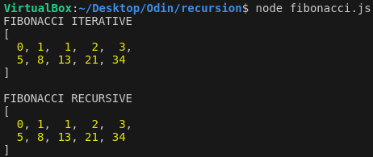
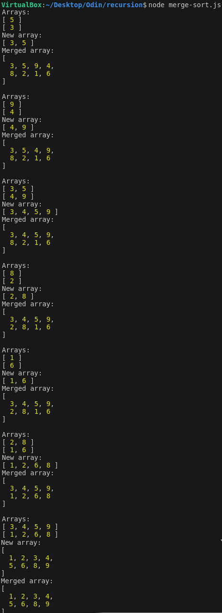

# Odin Project #13: Recursion

The goal of this Odin Project assignment was to create recursive functions for the Fibonacci sequence and merge sort.

I started and finished this project in February 2023.

## Assignment

[The Odin Project - JavaScript - #13 Recursion](https://www.theodinproject.com/lessons/javascript-recursion)

## Technology

- Vanilla JavaScript

## Key Concepts

- Computer science
- Recursive functions
- Fibonacci sequence
- Merge sort

## Links

[My Other Projects](https://brightneon7631.github.io/odin-scrimba-projects/)

## Screenshots

### Fibonacci sequence given n = 10



### Merge sort given array = [5, 3, 9, 4, 8, 2, 1, 6]



## Deployment

```bash
# clone repo
git clone

# run scripts
node fibonacci.js
node merge-sort.js
```
